# Prediction of Cross Country Results From School Data
**Analysis by [Nathaniel Webster](https://www.linkedin.com/in/nathaniel-webster/?trk=opento_sprofile_topcard)**  
**Published April 2025**

## Executive Summary
From analysis of team results at the California cross country state championships and datasets about public and private schools in California, measures of a school were shown to be indicative of the team’s performance. In particular, enrollment size, whether a school is private or public, and percentage eligible for free meals were all found to be correlated to team success.

## Introduction
As a former cross country and track athlete, I have long been interested in why some teams are a cut above the rest. Everyone trains hard, so do some teams just get lucky with talented individuals? Or are there deeper reasons having to do with the school that a team comes from? I’ve expected that metrics of the quality of a school and the resources its community has would be a good indicator of success in cross country. I decided to explore this through the lens of the California CIF state championships, where every November the top high school teams in the state compete for glory.

There are ten divisions at the state championships, five each for boys and girls. The winning team of each division is declared a state champion. Divisions are determined based on school enrollment size, with the goal of maintaining competitive balance. I performed a diagnostic analysis on the most recent state championships, aiming to determine why the results turned out the way they did by looking at data about the schools competing.

## Methodology
I started my data collection by obtaining [2024 state championship results](https://ca.milesplit.com/meets/643068-cif-state-xc-championships-2024/results/1108705/formatted/) from MileSplit CA. I focused on the team results, which contained measures such as how the team placed and the average time of each of its runners (team time average). These results weren’t available in an easily downloadable format, so I used Selenium to capture the HTML of the webpage and BeautifulSoup to parse it for the correct tables. I then used Pandas to perform some basic data cleaning, such as dropping an unnecessary “Video” column and checking for duplicate teams and individuals. I also split the “Times” column into a 1-5 Split column and a Team Time Average column. Then I combined the results from all divisions into one table, and exported this as a CSV to later use in MySQL. 

To find additional information about the schools competing in the state championships, I downloaded several datasets from the California Department of Education. I first wanted to get the enrollment for each school, so I downloaded the [2023-24 Census Day Enrollment Data](https://www.cde.ca.gov/ds/ad/filesenrcensus.asp). This is a large dataset containing enrollment breakdowns by state, county, school district, school, and different groups within a school. On my local MySQL server, accessed through MySQL Workbench, I filtered the Census Day Enrollment dataset into a view that contained only the total enrollment for high schools. I performed a similar process for the [2023-24 Private School enrollment](https://www.cde.ca.gov/ds/si/ps/index.asp) dataset, also from the CA Department of Education.

Matching the names of teams in the state championship results with the name of the corresponding school proved to be the most challenging part of the data wrangling process. I first tried to do a simple string match, but only 10% of teams had an exact match in the enrollment datasets. Looking at the composition of last words in the names of the schools in the enrollment data compared to the cross country results, I realized the team results were likely omitting the last word (such as ‘High’, ‘Academy’, or ‘School’). So I next tried joining the tables on the team name being a substring of the school name. This resulted in about 90% of teams having a match, though many had multiple matches. Around a third of teams had a unique match, so this was a good step.

I then used minimum [Levenshtein distance](https://en.wikipedia.org/wiki/Levenshtein_distance) to pick the matching school for teams with multiple substring matches. For teams that had 10 or more substring matches, I felt it wasn’t realistic to find the right match from Levenshtein distance, so I excluded them from the results. I also excluded teams where the enrollment data included multiple schools of the same name. Ultimately I found a matching school for 153 out of 180 teams in the state championships.

From there it was a mostly straightforward process of joining the state championship results and school enrollment data with additional school data, all sourced from the CA Department of Education. I took the graduation rate from the [2023-24 Adjusted Cohort Graduation Rate and Outcome dataset](https://www.cde.ca.gov/ds/ad/filesacgr.asp). I used percent of students eligible for free meals from the [Free or Reduced-Price Meal (Student Poverty) dataset](https://www.cde.ca.gov/ds/ad/filessp.asp). I used chronic absenteeism rate from the [2023-24 Chronic Absenteeism dataset](https://www.cde.ca.gov/ds/ad/filesabd.asp). From the California Assessment of Student Performance and Progress, I used the [2023-24 California Statewide ELA and Mathematics combined research file](https://caaspp-elpac.ets.org/caaspp/ResearchFileListSB?ps=true&lstTestYear=2024&lstTestType=B&lstCounty=00&lstDistrict=00000&lstFocus=a) to gather data on Smarter Balanced Assessment scores for each school. All 11th graders are required to take these assessments. I used data including each school’s mean Mathematics and English Language Arts scores, as well as percentages of students meeting expectations, not meeting expectations, or exceeding expectations. There was some minimal data cleaning I needed to perform in MySQL, such as converting metrics represented by percentage strings to floating points.

It is important to note that private schools are not required to report their data to California, so I was only able to gather enrollment data for the public schools.

After combining data for each school, I exported it to Tableau for visualization and analysis, and used MySQL queries for some additional summary statistics.

## Results

All visualizations including interactive dashboards can be viewed here: [See Dashboard on Tableau Public](https://public.tableau.com/app/profile/nathaniel.webster/viz/CIFXCSchoolMetrics/SchoolPerformanceMetrics)

I decided to look first at the effect of a school’s enrollment size on how well their team performed. Plotting team time average—simply the average finishing time of each of the team’s runners—vs the school’s enrollment, we see a correlation between enrollment and faster times. Note that a lower team time average is better. This holds for both boys and girls teams, as the regression for both groups has a statistically significant p-value. The R-squared value for boys is 0.25 compared to 0.11 for girls teams, so enrollment explains some but not all of the variation in team time.

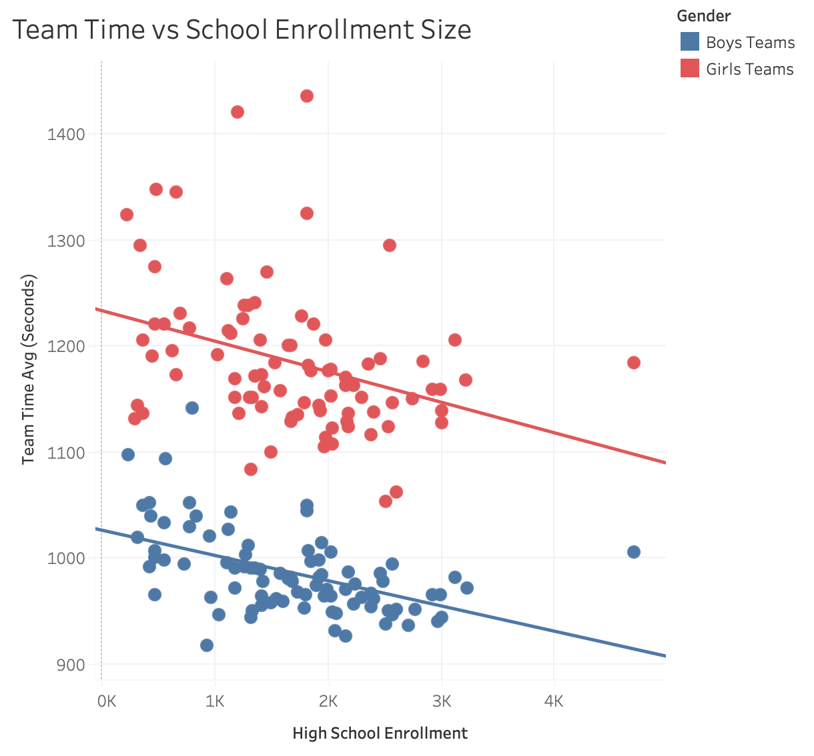

To get a clearer picture of the impact of enrollment size, I looked at how teams placed in their division vs enrollment. None of the divisions had clear trends or significant p-values. This suggests the division system in California sports is effective since the advantage of larger enrollments seems to be compensated for once schools are placed in divisions of similarly sized schools.

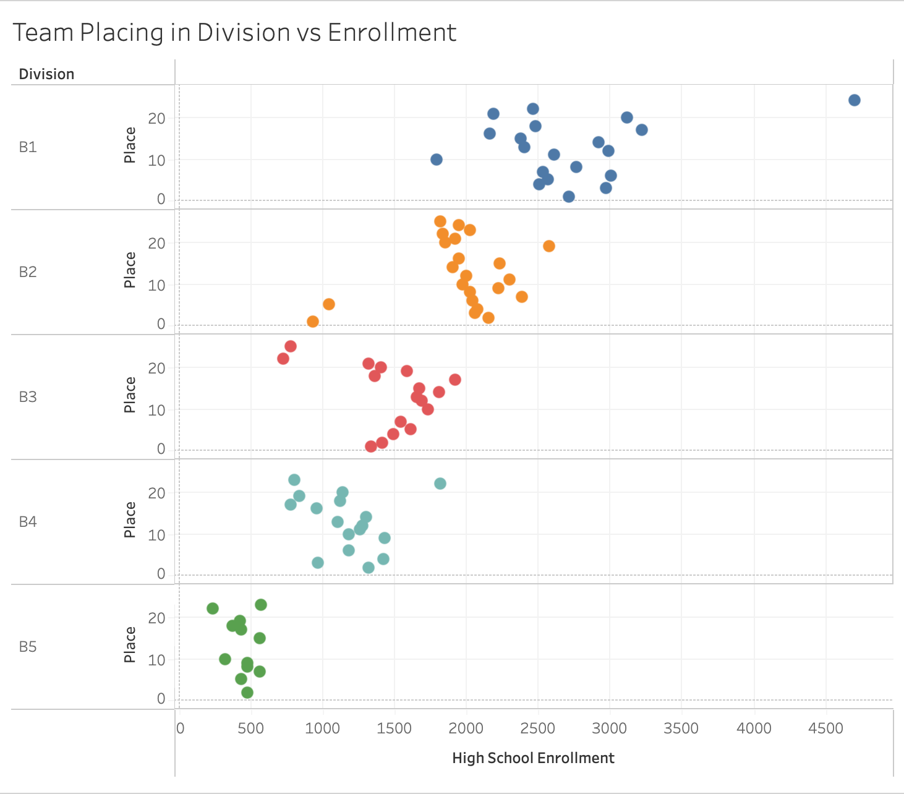

I was also curious to see if there was a difference between private and public schools. At first glance, it actually appeared that public schools were faster, with better average team times for both boys and girls.

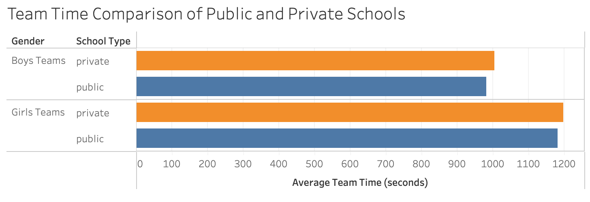

However, after controlling for enrollment size by breaking down the average times by division, these results flipped. In 6 out of 7 divisions that contained both public and private schools (some larger divisions had only public schools competing) the private schools were faster on average. 

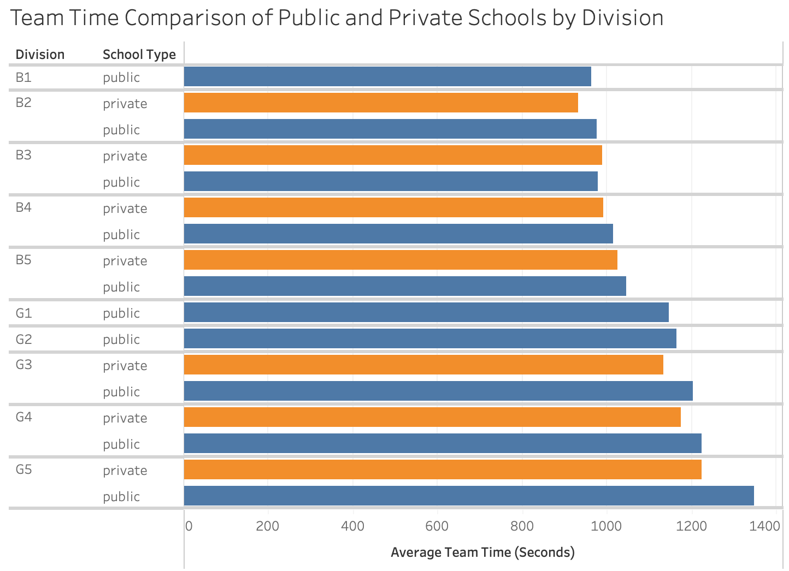

This trend held when looking at the distribution of how well private and public schools placed in their division. Despite making up only 34 out of 175 teams present in the data (19%), private schools were overrepresented in the top spots, taking 28% of spots in the top 12, and 43% of spots in the top 3. Filtering out division 1 schools, which were only public, and division 5, which were mainly private, we still see private schools overrepresented in top spots.

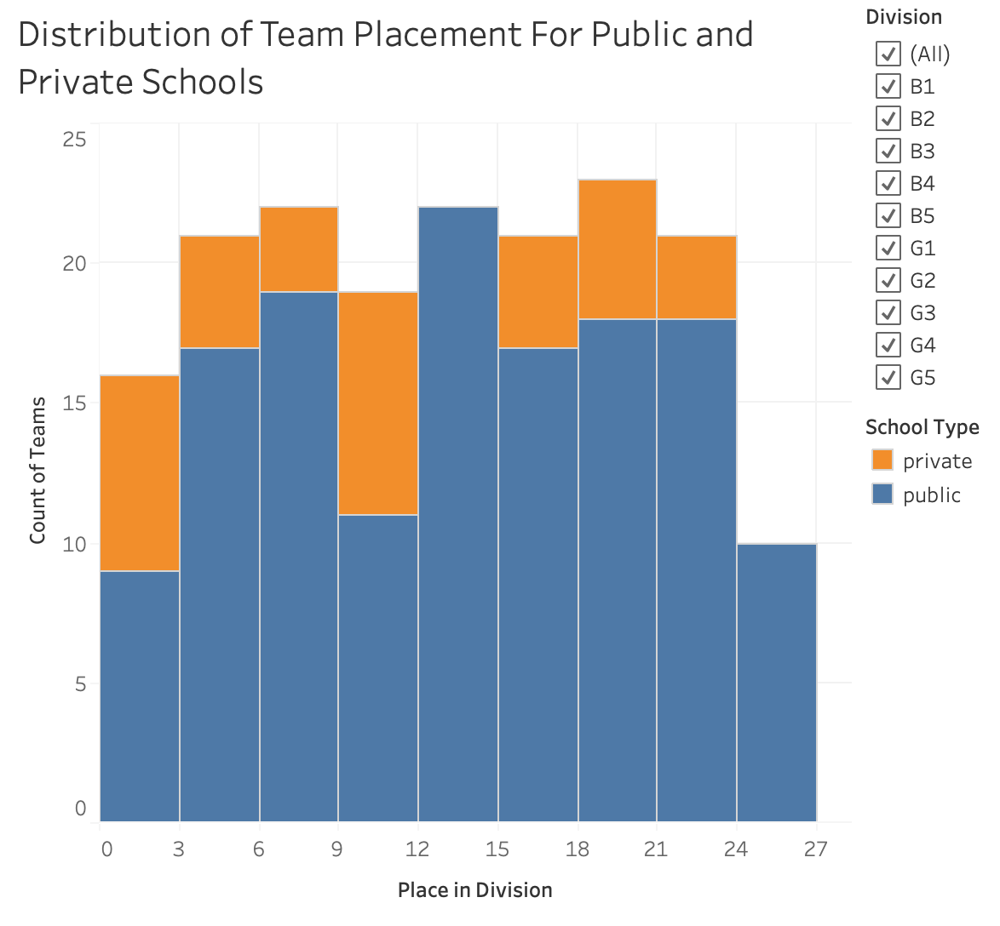
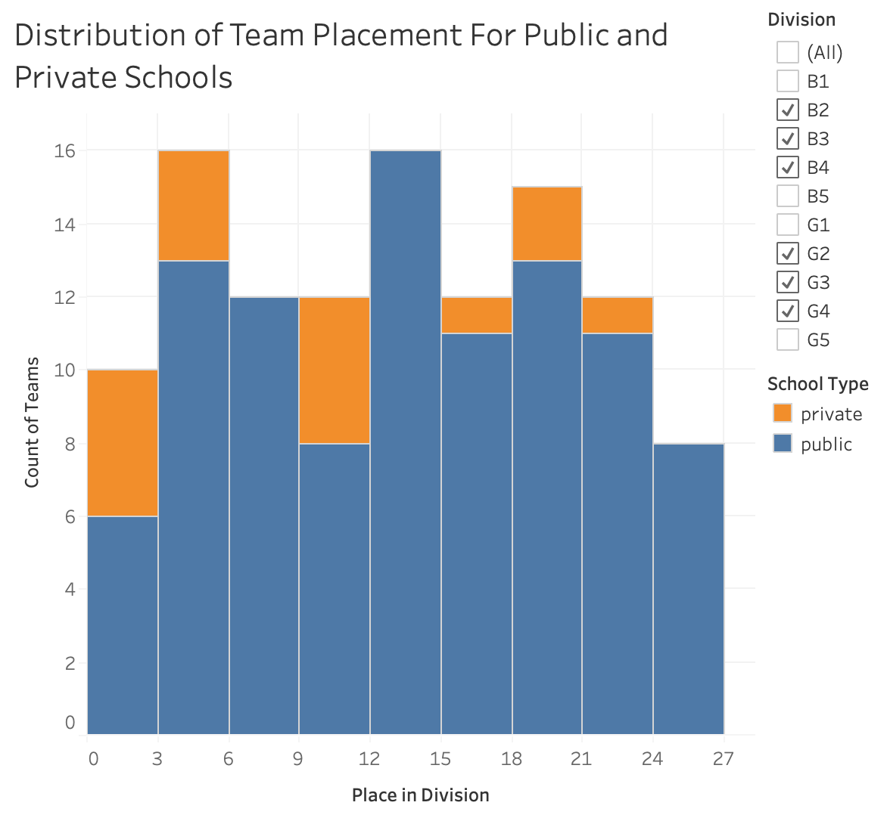
*Note: while each bin should have an equal number of teams, there are some discrepancies since I wasn’t able to identify which school all the teams belonged to.*

Next I looked at other indicators of school quality and how they correlated with team time. This remaining data is only available for public schools. Plotting team time average vs graduation rate shows some correlation, with higher graduation rates corresponding to better team times, but the R-squared is only around 0.1.

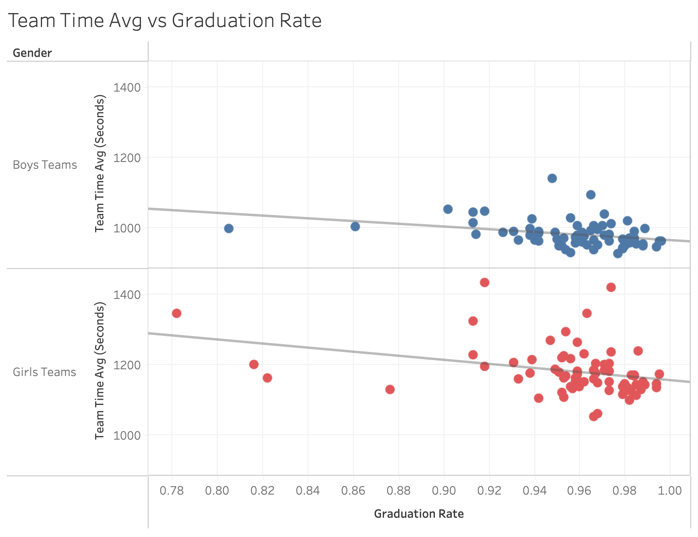

Similarly, higher chronic absenteeism rates weakly correlate with slower team times, with an R-squared of 0.11 for boys teams and 0.17 for girls teams.

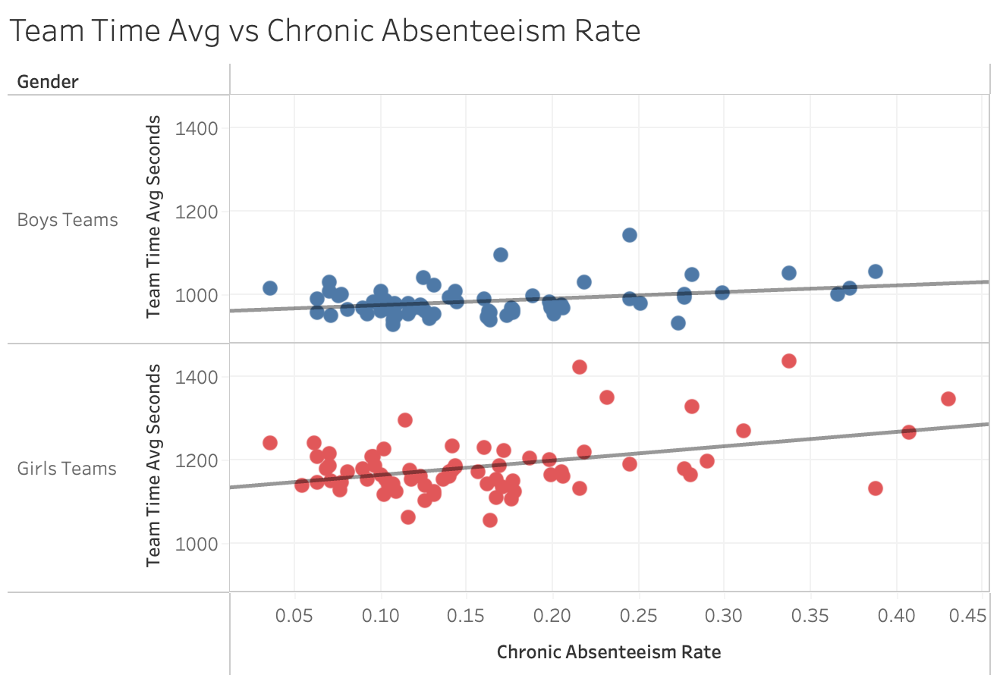

There is a slightly stronger correlation between the percent of students eligible for free meals and slower team time averages. The girls teams had an R-squared value of 0.30, with 0.15 for boys teams.

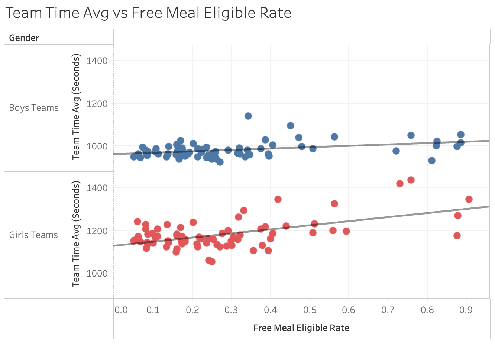

Mean scores on the Smarter Balanced English Language Arts and Mathematics tests also correlated with team time, where higher average scores correlated with faster teams. These R-squared values were between 0.12 and 0.20.

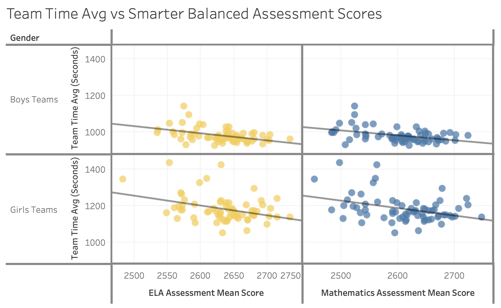

I also looked at the characteristics of schools that made it to the state championships by comparing their data to the state average across all schools. 75% of schools at the state championships performed better than the state average in chronic absenteeism rate and Smarter Balanced assessment scores. In percent of students eligible for free meals and graduation rate, the teams performed even better compared to the California average, with 100% of non-outlier teams having a higher graduation rate than the average.

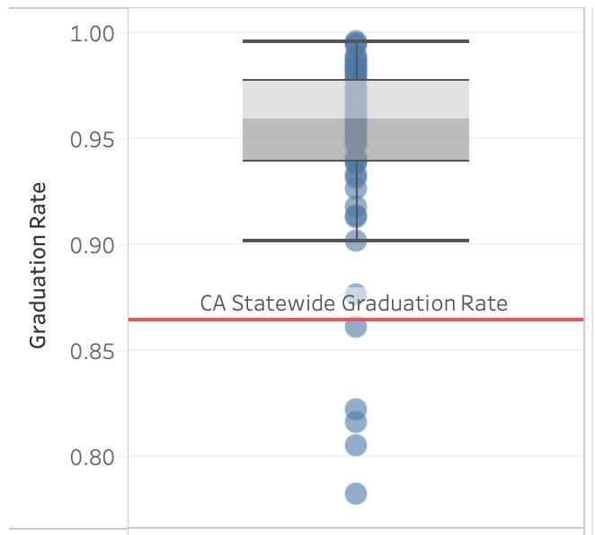
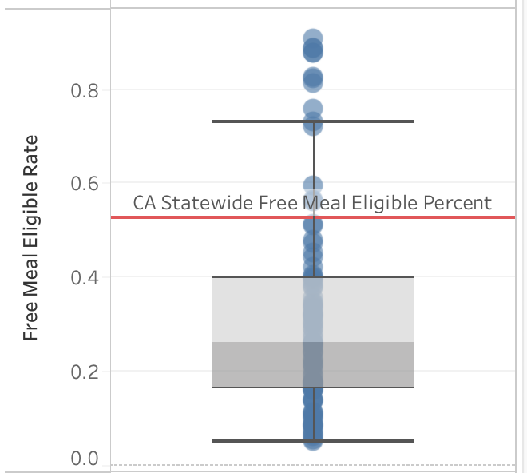

## Discussion of Key Findings
These results show there are several characteristics of a school that can be used in predicting the success of its cross country team. Enrollment size is certainly a key one, since we can see from the state championship data that larger schools tend to have faster teams. This is likely due to the larger talent pool that larger schools are able to draw from. Having more available students increases the chances of having talented runners.

Whether a school is private or public also showed to be influential in the state championship results, with private schools running faster than their similarly sized public school counterparts. This could suggest that private schools have greater resources to put towards athletics, or perhaps their opportunities attract more talented runners. While this divide between private and public schools is present in the data, more data would be useful to confirm the trend.

The other measures of schools considered in this analysis, graduation rate, chronic absenteeism, free meal eligibility, and test scores on the Smarter Balanced assessments, all correlated with team time averages to varying degrees. The comparison of teams in the state championships with the state averages also showed that being strong in these metrics is indicative of cross country success, since only the top teams make it to the championships. Amongst these factors, free meal eligibility, which is indicative of poverty, had the strongest relationship with team performance. Though this would require more analysis, I suspect test scores, absenteeism, and graduation rate are all closely related to poverty and school resources as well. So these factors representing the quality of the schools all suggest that schools with wealthier families perform better in cross country. This makes sense, as wealthier areas likely have more resources to devote to their cross country teams and the students could have fewer obstacles to their training.

## Conclusion
This analysis showed that data about a school, such as enrollment size, poverty measures, and academic performance can be used as an indicator for cross country performance. With more data, such as additional cross country results and measures of the school, a model could likely be made to predict cross country results from data about the team’s school.

While this analysis was revealing, it could benefit from being expanded in scope. Future analysis could look at more or larger cross country meets to provide a more complete picture of the characteristics of schools with successful teams. This analysis was limited by only considering teams at the state championships, which is a biased sample since a team has to be very strong to even qualify for the championships. I suspect some of the trends discovered here would be even more pronounced when considering a broader range of schools.

This analysis could also be improved by finding a source for the state championship results where the school names more closely match official records or there is additional identifying information for each school. While I was able to match most of the teams with the right school, I wasn’t able to capture all the teams in the data, and may have misidentified some. A different data source could give more accurate results.

## Data Sources
- [2024 CIF State Cross Country Championship Results from MileSplit CA](https://ca.milesplit.com/meets/643068-cif-state-xc-championships-2024/results/1108705/formatted/)
- [2023-24 Census Day Enrollment Data from CA Department of Education](https://www.cde.ca.gov/ds/ad/filesenrcensus.asp)
- [2023-24 Private School Data File from CA Department of Education](https://www.cde.ca.gov/ds/si/ps/index.asp)
- [2023-24 Adjusted Cohort Graduation Rate and Outcome Data from CA Department of Education](https://www.cde.ca.gov/ds/ad/filesacgr.asp)
- [2023-24 Free or Reduced-Price Meal (Student Poverty) Data from CA Department of Education](https://www.cde.ca.gov/ds/ad/filessp.asp)
- [2023-24 Chronic Absenteeism Data from CA Department of Education](https://www.cde.ca.gov/ds/ad/filesabd.asp)
- [2023-24 California Statewide ELA and Mathematics combined research file, All student groups from California Assessmet of Student Performance and Progress](https://caaspp-elpac.ets.org/caaspp/ResearchFileListSB?ps=true&lstTestYear=2024&lstTestType=B&lstCounty=00&lstDistrict=00000&lstFocus=a)
